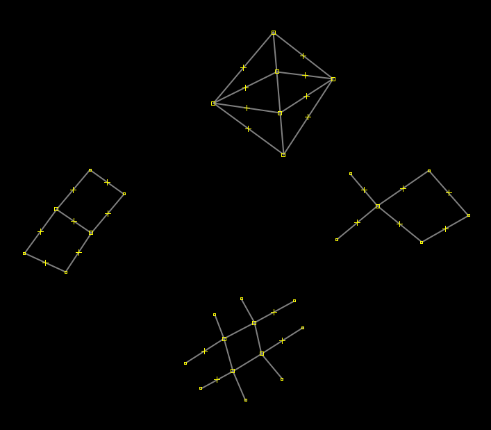
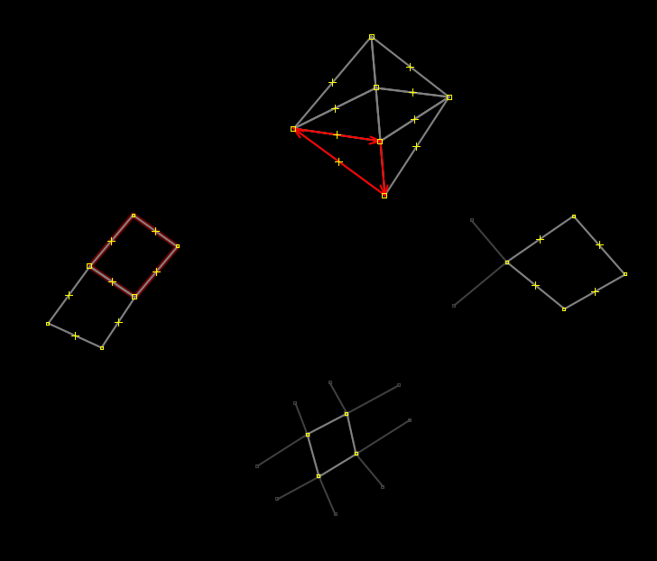

# OSM to GeoJSON

This script simplifies drawing adjacent polygons, so you don't have to exactly trace over points.
Basically open JOSM and draw arbitrary ways. Intersect those with other ways. Draw connections and tails.
The important thing is to ensure every intersection node belongs to all ways that intersect there.
Do not cross the lines without explicitly adding a node.

For this source:

We get those ten polygons:

Hope it helps!
